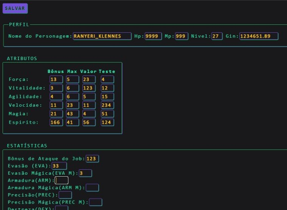

# Ficha de RPG Online - Final Fantasy 🎲🗡️

> **Cápsula do Tempo:** Este é um repositório muito especial. Foi o **meu primeiríssimo projeto de código**, desenvolvido em uma época em que eu sequer cogitava cursar Análise e Desenvolvimento de Sistemas (ADS). É o meu verdadeiro "Hello World" no desenvolvimento web!

---

## 📸 Visão do Projeto

---

## ✨ A Origem (Por que eu criei isso?)

Antes de pensar em arquiteturas complexas, APIs de integração ou bancos de dados relacionais, minha motivação inicial com a programação era puramente prática e voltada para o lazer. 

Eu queria colocar a "mão na massa" (*hands-on*) para resolver um problema real da minha rotina: a lentidão de gerenciar fichas de papel nas sessões de RPG. O modelo visual e as regras foram baseados no sistema do **FFRPG** (Final Fantasy RPG).

Como eu mesmo registrei no código na época:

> *"Estou elaborando esta ficha com o intuito de automatizar o RPG de mesa que jogo aos sábados quinzenais."*
> — Ranyeri Klennes

---

## 🛠️ A Base Tecnológica

Neste primeiro contato com a web, utilizei as ferramentas mais fundamentais:

* **HTML:** Para a marcação e estruturação dos atributos, inventário e dados do personagem.
* **CSS:** Para a estilização, buscando trazer a identidade visual clássica dos menus de Final Fantasy.

---

## 📈 Reflexão e Evolução

Olhar para este código hoje é um excelente lembrete de como minha jornada começou. Não há frameworks modernos, segurança avançada ou responsividade complexa aqui. No entanto, há o elemento mais importante para qualquer desenvolvedor: **a curiosidade de usar a tecnologia para criar uma solução**. 

Foi exatamente brincando com essas tags HTML para o meu RPG de sábado que a semente da programação foi plantada, muito antes da faculdade e da minha atuação profissional atual.

---
Desenvolvido por [Ranyeri Klennes](https://portfolio-ranyeri-klennes.vercel.app/) onde tudo começou.